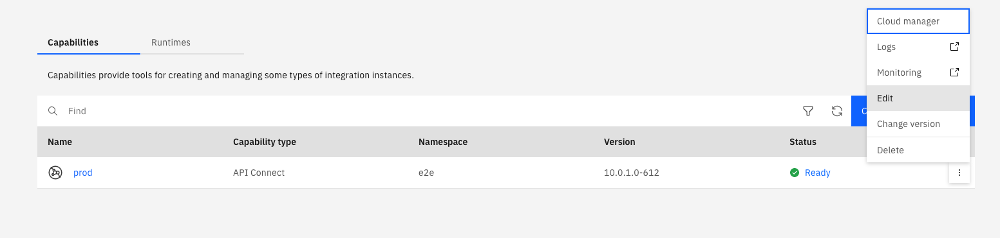
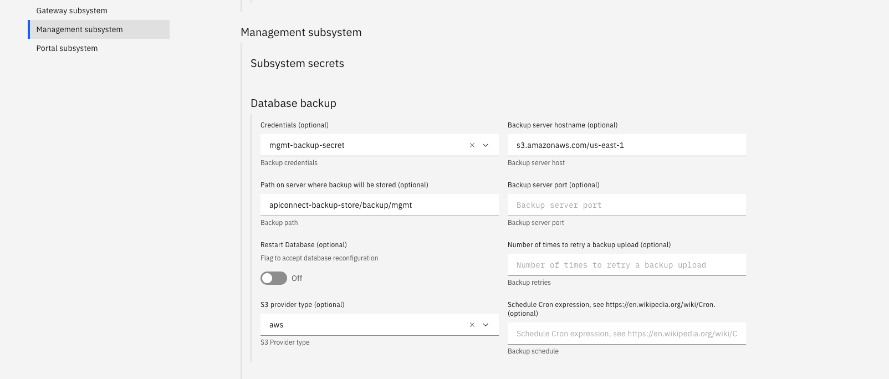
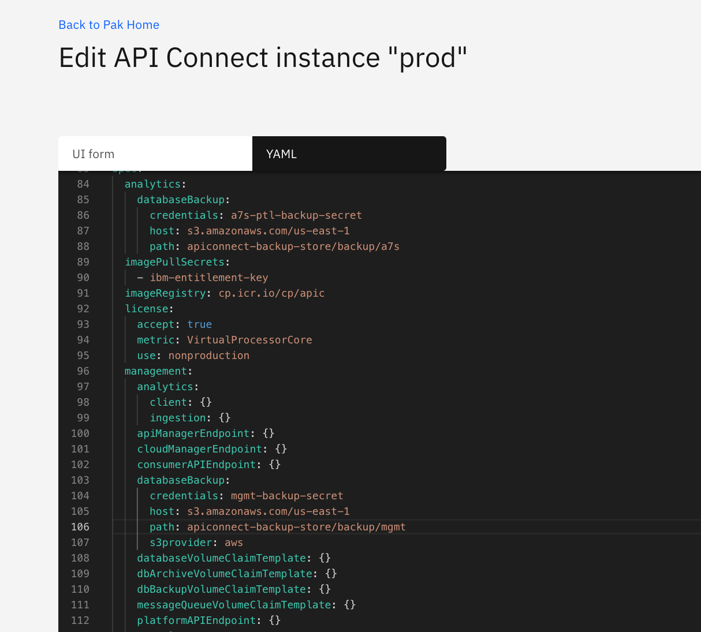

# Steps to change DatabaseBackup configuration in the Management Subsystem for CP4I Installations

The following are steps and a script to allow you to change the `DatabaseBackup` configuration in the Management Subsystem section of your APIConnect Cluster capability in CP4i installations.

Please refer to the Knowledge Center for procedure on configuring backup settings for Management subsystem: https://www.ibm.com/support/knowledgecenter/en/SSMNED_v10/com.ibm.apic.install.doc/tapic_db_backup_restore_apic.html

This is a workaround to a known issue and has been addressed in v10.0.1.0

**Note: This script is unsupported for APIConnect Operator versions v10.0.1.0 or later.**

**This procedure is only compatible with Linux and Mac environments.**


## Scenarios when this procedure and script are needed

1. A customer wants to change their backup configuration from the default, post-install.
2. A customer wants to update their backup configuration to a different location (eg. different S3 bucket)
3. A customer has incorrectly configured their backup configuration and wants to remedy that (eg. incorrect S3 bucket name)

## FAQs
- Is the script rerunnable if something goes wrong: **Yes**
  
- Where can I find extra data for further analysis:
  - API Connect Operator logs
    - eg. `kubectl logs ibm-apiconnect-6c48b47cf8-w4ppl`
  - Pgbackrest stanza-create job logs
    - eg. `kubectl logs management-8359bacc-postgres-stanza-create-nh2fx`
  - Postgres Operator logs
    - eg. `kubectl logs postgres-operator-6947bd7769-hvxzm -c operator`
    - eg. `kubectl logs postgres-operator-6947bd7769-hvxzm -c apiserver`
  - Postgres Database logs
    - eg. `kubectl logs management-8359bacc-postgres-584c88dcd6-pn676 -c database`
  
- How long will this procedure be needed?: **This playbook is no longer needed for v10.0.1.0**

## Procedure

1. Ensure that you have `kubectl` installed from the location where you will run the script
   - https://kubernetes.io/docs/tasks/tools/install-kubectl/
   - Follow your Kubernetes provider instructions on how to find and connect to your Kubernetes cluster with `kubectl`

2. Verify you are able to run kubectl commands against your Kubernetes cluster
  ```
    $ kubectl get nodes
    NAME                                         STATUS   ROLES    AGE     VERSION
    ip-10-0-149-28.us-west-1.compute.internal    Ready    master   2d23h   v1.18.3+2cf11e2
    ip-10-0-158-211.us-west-1.compute.internal   Ready    worker   2d22h   v1.18.3+2cf11e2
    ip-10-0-160-129.us-west-1.compute.internal   Ready    worker   2d23h   v1.18.3+2cf11e2
    ip-10-0-165-229.us-west-1.compute.internal   Ready    worker   2d23h   v1.18.3+2cf11e2
    ip-10-0-167-19.us-west-1.compute.internal    Ready    worker   2d23h   v1.18.3+2cf11e2
    ip-10-0-174-21.us-west-1.compute.internal    Ready    master   2d23h   v1.18.3+2cf11e2
    ip-10-0-179-122.us-west-1.compute.internal   Ready    worker   2d23h   v1.18.3+2cf11e2
    ip-10-0-187-128.us-west-1.compute.internal   Ready    worker   2d23h   v1.18.3+2cf11e2
  ```
3. Copy the script below to the location where you wish to run the script from.
4. Name the script `change-mgmtbackup-cfg.sh`
5. In a terminal, run `chmod +x change-mgmtbackup-cfg.sh`
6. In a terminal, run `./change-mgmtbackup-cfg.sh <namespace> <mgmt_name>`
  - where `<namespace>` is the names˜pace where your Management Subsystem is deployed eg. `default`

## Summary of what the script does:

1. Checks current configuration
2. Scales down the API Connect Operator as we don't want the Operator reconciling any changes we make just yet
3. Creates the pgo-client deploy - this is a pod that allows us to interface with the Postgres Operator
4. See steps below on how to add new backup configuration using Platform Navigator.
5. Once updated and customer agrees to proceed, the current postgres deployment is removed (no data is lost)
6. Scales up the API Connect Operator
7. The Operator reconciles everything back to normal, including creating the postgres deployment, with the new backup configuration

# Updating your ManagementCluster DatabaseBackup settings using Platform Navigator:

1. In the 'Capabilities' section of your Platform Navigator, select your APIConnect instance
2. In the menu on the right, select 'Edit'
    
3. In the Management subsystem section, update your DatabaseBackup parameters
    
    Alternatively you can use the YAML form editor:
    
4. Please refer to the Knowledge Center for procedure on configuring backup settings for Management subsystem: https://www.ibm.com/support/knowledgecenter/en/SSMNED_v10/com.ibm.apic.install.doc/tapic_db_backup_restore_apic.html

```
#!/bin/bash

ns=$1
[[ -z "$ns" ]] && echo "./change-mgmtbackup-cfg.sh <namespace> <apic_name>" && exit 1

apic_name=$2
mgmt_name=$3

print_current_cfg() {
    ns=$1
    apic_name=$2
    #Get all individual database backup values that are currently set in the apiconnectcluster CR
    s3provider=$(kubectl get apiconnectcluster $apic_name -n $ns -o jsonpath="{..management.databaseBackup.s3provider}")
    host=$(kubectl get apiconnectcluster $apic_name -n $ns -o jsonpath="{..management.databaseBackup.host}")
    path=$(kubectl get apiconnectcluster $apic_name -n $ns -o jsonpath="{..management.databaseBackup.path}")
    retries=$(kubectl get apiconnectcluster $apic_name -n $ns -o jsonpath="{..management.databaseBackup.retries}")
    credentials=$(kubectl get apiconnectcluster $apic_name -n $ns -o jsonpath="{..management.databaseBackup.credentials}")
    schedule=$(kubectl get apiconnectcluster $apic_name -n $ns -o jsonpath="{..management.databaseBackup.schedule}")

    [[ ! -z "$s3provider" ]]  && echo "S3 provider:  $s3provider"
    [[ ! -z "$host" ]]        && echo "Host:         $host"
    [[ ! -z "$path" ]]        && echo "Path:         $path"
    [[ ! -z "$retries" ]]     && echo "Retries:      $retries"
    [[ ! -z "$credentials" ]] && echo "Credentials:  $credentials"
    [[ ! -z "$schedule" ]]    && echo "Schedule:     $schedule"
}

abort() {
    echo "Answer was: $1"
    echo "Abort"
    exit 1
}

echo
echo "This script will allow you to change the Management Subsystem DatabaseBackup configuration in your APIConnect Cluster capability"
echo

echo "Searching for ibm-apiconnect operator deploy..."

oc_ns="openshift-operators"
op_ns="$ns"
op_out=$(kubectl get deploy ibm-apiconnect -n $op_ns > /dev/null 2>&1)

if [ "$?" -eq 1 ]; then
    op_ns="$oc_ns"
    op_out=$(kubectl get deploy ibm-apiconnect -n $oc_ns)
    if [ "$?" -eq 1 ]; then
        echo
        echo "Could not find APIConnect Operator in namespace \"$ns\" or \"$oc_ns\""
        echo
        abort
    fi
fi

echo "Found deploy in namespace: $op_ns"
echo
kubectl get deploy ibm-apiconnect -n $op_ns

#If user gives the apic cluster name check if it exists, else get the name of the apic cluster name that is deployed in the namespace
if [ -z "$apic_name" ]; then
  apic_name=$(kubectl get apiconnectcluster -n $ns -o yaml | grep name: | head -n1 | awk -F ": " '{print $2}')

  if [ -z "$apic_name" ]; then
    echo
    echo "No APIConnect Clusters in namespace \"$ns\""
    echo
    abort
  fi
fi

apic_out=$(kubectl get apiconnectcluster $apic_name -n $ns)
if [ "$?" -eq 1 ]; then
    echo
    echo "APIConnect Cluster \"$apic_name\" does not exist in namespace \"$ns\""
    echo
    abort
fi

if [ -z "$mgmt_name" ]; then
    mgmt_name="${apic_name}-mgmt"
fi

mgmt_out=$(kubectl get managementcluster ${mgmt_name} -n $ns)
if [ "$?" -eq 1 ]; then
    echo
    echo "Management Cluster \"$mgmt_name\" does not exist in namespace \"$ns\""
    echo
    abort
fi

echo
echo "APIConnect Cluster: "
echo "$apic_out"

if echo "$apic_out" | grep -q Pending; then
    #Halt script from running and ask user do they want to continue
    echo
    read -p "WARNING: APIConnect cluster $apic_name is NOT READY. Proceed? (y/n) " -n 1 -r
    echo

    #If the user replies with anything other than Y or y stop the script
    if [[ ! $REPLY =~ ^[Yy]$ ]]
    then
        abort $REPLY
    fi
fi

echo
echo "APIConnect Management subsystem: "
echo "$mgmt_out"
if echo "$mgmt_out" | grep -q Pending; then
    echo
    #Halt script from running and ask user do they want to continue
    read -p "WARNING: Management subsystem $mgmt_name is NOT READY. Proceed? (y/n) " -n 1 -r
    echo

    #If the user replies with anything other than Y or y stop the script
    if [[ ! $REPLY =~ ^[Yy]$ ]]
    then
        abort $REPLY
    fi
fi

echo
echo "Management Subsystem DatabaseBackup configuration (if set):"
echo
print_current_cfg $ns $apic_name
echo

#Halt script from running and ask user do they want to continue
read -p "Changing the Management Subsystem DatabaseBackup configuration will result in a short downtime of the database. There will be no loss of data. Proceed? (y/n) " -n 1 -r
echo

#If the user replies with anything other than Y or y stop the script
if [[ ! $REPLY =~ ^[Yy]$ ]]
then
    abort $REPLY
fi

cluster_name=$(kubectl get mgmt ${apic_name}-mgmt -n $ns  -o yaml | grep db: | grep -v f: | awk -F ": " '{print $2}')
image_registry=$(kubectl get apiconnectcluster $apic_name -n $ns  -o yaml | grep imageRegistry: | grep -v f: | awk -F ": " '{print $2}')
appVersion=$(kubectl get apiconnectcluster $apic_name -n $ns  -o yaml | grep appVersion: | grep -v f: | awk -F ": " '{print $2}')
version=$(kubectl get apiconnectcluster $apic_name -n $ns  -o yaml | grep version: | grep -v f: | awk -F ": " '{print $2}')
image_pull_secret=$(kubectl get apiconnectcluster $apic_name -n $ns  -o yaml | grep -A1 imagePullSecrets | grep -v f: | tail -n1 | awk -F "- " '{print $2}')

if [ ! -z $appVersion ]; then
    version=$appVersion
fi

echo
echo "Name:                 $apic_name"
echo "Database name:        $cluster_name"
echo "Product version:      $version"
echo "Image Registry:       $image_registry"
echo "Image Pull Secret:    $image_pull_secret"
echo

if [[ "$version" == "10.0.1.0"* ]]; then
    pgo_client_image_tag="sha256:3295df5e00f11c072895627fdc5e84ca911c378b5ceb8b7c12ca55dfb7066891"
elif [[ "$version" == "10.0.0.0"* ]]; then
    pgo_client_image_tag="sha256:c728dee3458e38efced0474f95cd84f168f065a47761e483cd3551cdde8c824b"
else
    echo "Unsupported product version ${version} for ManagementCluster. Please contact IBM support." && exit 1
fi 

#Halt script from running and ask user do they want to continue
read -p "Please review the APIConnect Cluster configuration and confirm these are correct. Proceed? (y/n) " -n 1 -r
echo

if [[ $REPLY =~ ^[Nn]$ ]]; then
    abort $REPLY
fi

#Creating a pgo client pod so that it will allow us to interface with the postgres operator to allow us to create a new management cluster with the new desired/updated config
echo "Creating PGO client pod..."
cat <<EOF | kubectl create -f -
{
    "apiVersion": "apps/v1",
    "kind": "Deployment",
    "metadata": {
        "name": "pgo-client",
        "namespace": "$ns",
        "labels": {
            "vendor": "crunchydata"
        }
    },
    "spec": {
        "replicas": 1,
        "selector": {
                "matchLabels": {
                        "name": "pgo-client",
                        "vendor": "crunchydata"
                }
        },
        "template": {
            "metadata": {
                "labels": {
                    "name": "pgo-client",
                    "vendor": "crunchydata"
                }
            },
            "spec": {
                "imagePullSecrets": [
                    { "name": "$image_pull_secret" }
                ],
                "containers": [
                    {
                        "name": "pgo",
                                "image": "$image_registry/ibm-apiconnect-management-pgo-client@$pgo_client_image_tag",
                        "imagePullPolicy": "IfNotPresent",
                        "env": [
                            {
                                "name": "PGO_APISERVER_URL",
                                "value": "https://postgres-operator.$ns.svc:8443"
                            },
                            {
                                "name": "PGOUSERNAME",
                                "valueFrom": {
                                    "secretKeyRef": {
                                        "name": "pgouser-admin",
                                        "key": "username"
                                    }
                                }
                            },
                            {
                                "name": "PGOUSERPASS",
                                "valueFrom": {
                                    "secretKeyRef": {
                                        "name": "pgouser-admin",
                                        "key": "password"
                                    }
                                }
                            },
                            {
                                "name": "PGO_CA_CERT",
                                "value": "pgo-tls/tls.crt"
                            },
                            {
                                "name": "PGO_CLIENT_CERT",
                                "value": "pgo-tls/tls.crt"
                            },
                            {
                                "name": "PGO_CLIENT_KEY",
                                "value": "pgo-tls/tls.key"
                            }
                        ],
                        "volumeMounts": [
                            {
                                "name": "pgo-tls-volume",
                                "mountPath": "pgo-tls"
                            }
                        ]
                    }
                ],
                "volumes": [
                    {
                        "name": "pgo-tls-volume",
                        "secret": {
                            "secretName": "$mgmt_name-client",
                            "items": [
                                {
                                    "key": "tls.crt",
                                    "path": "tls.crt"
                                },
                                {
                                    "key": "tls.key",
                                    "path": "tls.key"
                                }
                            ]
                        }
                    }
                ]
            }
        }
    }
}
EOF
if [ "$?" -eq 1 ]; then
  echo "Error creating PGO client deployment"
  echo 
  kubectl get deploy pgo-client -n $ns
  if [ "$?" -eq 0 ]; then
    echo
    read -p "Please confirm the pgo-client pod already exists and is READY 1/1. Proceed? (y/n) " -n 1 -r
    echo

    if [[ ! $REPLY =~ ^[Yy]$ ]]
    then
        abort $REPLY
    fi
  else
    exit 1
  fi
fi

kubectl get pods -n $ns | grep pgo-client | grep -q Running
while [ "$?" -eq 1 ]; do
    echo "Waiting for pgo-client to start..."
    out=$(kubectl get pods -n $ns) 
    echo "$out" | head -n1
    echo "$out" | grep pgo-client
    echo

    sleep 5
    kubectl get pods -n $ns | grep pgo-client | grep -q Running
done

pgo_client_pod_name=$(kubectl get pods -n $ns | grep pgo-client | tail -n1 | awk -F " " '{print $1}')

echo
echo "PGO Client pod name: $pgo_client_pod_name"
echo

out=$(kubectl get pods -n $ns) 
echo "$out" | head -n1
echo "$out" | grep pgo-client

echo
echo "######################################################################"
echo "Please update the ManagementCluster Subystem backup configuration now"
echo "######################################################################"
echo
echo "You can update your ManagementCluster DatabaseBackup settings via the Platform Navigator"
echo "Alternatively, you can update your APIConnect Cluster via the command-line with 'kubectl edit apiconnectcluster $apic_name -n $ns'"
echo "Example:"
cat << EOF
spec:
    management:
        databaseBackup:
            s3provider: aws
            host: s3.amazonaws.com/<region>
            path: <bucket-name>/<dir-1>/<dir-2>
            credentials: <your-creds-secret>
EOF
echo
read -p "Proceed when the configuration is updated. Proceed? (y/n) " -n 1 -r
echo

if [[ ! $REPLY =~ ^[Yy]$ ]]
then
    abort $REPLY
fi

REPLY=""
while [[ ! $REPLY =~ ^[Yy]$ ]]; do
    if [[ $REPLY =~ ^[Cc]$ ]]; then
        abort $REPLY
    fi

    echo
    echo "New DatabaseBackup configuration:"
    echo
    print_current_cfg $ns $apic_name
    echo

    credentials=$(kubectl get apiconnectcluster $apic_name -n $ns -o jsonpath="{..databaseBackup.credentials}")
    if [ ! -z "$credentials" ]; then
        kubectl get secret $credentials -n $ns > /dev/null 2>&1 

        if [  "$?" -eq 1 ]; then
            echo "WARNING: could not find secret \"$credentials\" in namespace \"$ns\""
            echo
            echo "Please create credentials secret now. Docs link: https://www.ibm.com/support/knowledgecenter/en/SSMNED_v10/com.ibm.apic.install.doc/tapic_db_backup_restore_apic.html"
            echo
        fi
    fi

    read -p "Please review the backup configuration and confirm these are correct. Reconfiguration will begin after proceeding. Proceed? (y/n/c n=recheck c=abort) " -n 1 -r
    echo
done

read -p "Restart database? This will result in a brief downtime of the database. Proceed with restarting database? (y/n) " -n 1 -r
echo

if [[ ! $REPLY =~ ^[Yy]$ ]]
then
    abort $REPLY
fi

#Scaling down the apic operator to 0. This is because if we have the operator running it will not allow us to delete a management cluster deployment as it will constantly redeploy the old deployment we want to change
echo "Scaling down APIC Operator..."
kubectl scale deploy ibm-apiconnect --replicas=0 -n $op_ns
if [ "$?" -eq 1 ]; then
  echo "Error scaling down ibm-apiconnect deployment"
  kubectl get deploy ibm-apiconnect -n $op_ns
  if [ "$?" -eq 1 ]; then
    echo
    read -p "If running the APIC Operator locally, please manually stop the APIC Operator now. Proceed when stopped. Proceed? (y/n) " -n 1 -r
    echo

    if [[ ! $REPLY =~ ^[Yy]$ ]]
    then
        echo "Answer was: $REPLY"
        echo
        abort
    fi
  else
    exit 1
  fi
fi

#Stopping database pods because currently there are no way of updating them so we need to delete and recreate
echo
echo "Stopping database pods..."
kubectl exec -it $pgo_client_pod_name -n $ns -- pgo delete cluster $cluster_name -n $ns --keep-data --no-prompt
if [ "$?" -eq 1 ]; then
  echo "Error stopping database pods" && exit 1
  kubectl scale deploy ibm-apiconnect --replicas=1 -n $op_ns
  [[ "$?" -eq 1 ]] && echo "Error scaling up ibm-apiconnect deployment" && exit 1
fi

kubectl get pgcluster $cluster_name -n $ns > /dev/null 2>&1 
while [ "$?" -eq 0 ]; do
  echo "Waiting for database to be stopped..."
  sleep 5
  kubectl get pgcluster $cluster_name -n $ns > /dev/null 2>&1 
done

echo "Database stopped"
echo
echo "Scaling up APIC Operator..."
echo

#Scaling the apiconnect operator back up. When the operator has scaled back up it will see that it is missing postgres deployments and will recreate them
kubectl scale deploy ibm-apiconnect --replicas=1 -n $op_ns
if [ "$?" -eq 1 ]; then
  echo "Error scaling up ibm-apiconnect deployment"
  kubectl get deploy ibm-apiconnect -n $op_ns
  if [ "$?" -eq 1 ]; then
    read -p "If running the APIC Operator locally, please manually start the APIC Operator. Proceed when started. Proceed? (y/n) " -n 1 -r
    echo

    if [[ ! $REPLY =~ ^[Yy]$ ]]
    then
        abort $REPLY
    fi
  else
    exit 1
  fi
fi

kubectl get pgcluster $cluster_name -n $ns > /dev/null 2>&1 
while [ "$?" -eq 1 ]; do
  echo "Waiting for database to be started..."
  sleep 5
  kubectl get pgcluster $cluster_name -n $ns > /dev/null 2>&1 
done
echo "Database started"
echo

kubectl get managementcluster $mgmt_name -n $ns | grep -q Running > /dev/null 2>&1 
while [ "$?" -eq 1 ]; do
  echo "Waiting for Management Subsystem $mgmt_name to be Ready..."
  sleep 5
  kubectl get managementcluster $mgmt_name -n $ns | grep -q Running > /dev/null 2>&1 
done
echo "ManagementCluster $mgmt_name ready"
echo

echo
echo "Backup settings successfully updated. Now polling for automatic Management subsystem backup completion..."
echo 

COUNTER=0
kubectl get job -n $ns | grep backrest-backup | grep -q "1/1" > /dev/null 2>&1
while [[ "$?" -eq 1 && $COUNTER -lt 120 ]]; do
  echo "Waiting for automatic Management subsystem backup to be Ready..."
  sleep 5
  let COUNTER+=1 
  kubectl get job -n $ns | grep backrest-backup  | grep -q "1/1" > /dev/null 2>&1
done

kubectl get job -n $ns | grep backrest-backup | grep -q "1/1" > /dev/null 2>&1
if [ "$?" -eq 1 ]; then
    echo "Automatic Management backup is still not Ready. However, backup settings successfully updated"
    echo "Please continue to monitor the status of the backup with command 'kubectl get job -n $ns | grep backrest-backup'"

    echo "Exiting..."
else
    echo "Automatic Management subsystem backup ready"
    echo
    echo "Success"
fi

exit 0

```